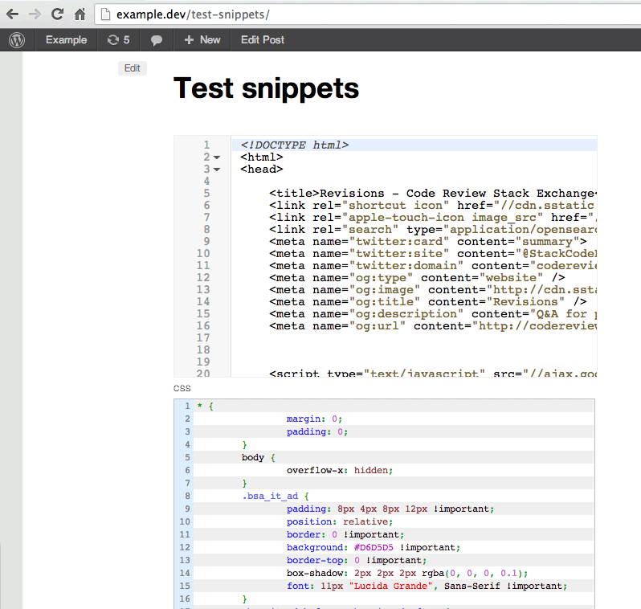

Snippets Shortcode
==================

Custom post type to hold Code Snippets. 
A Shortcode is provided to show code blocks in the frontend. 
Uses [CodeMirror](http://codemirror.net/) in the backend.

In the frontend, Snippets can be shown in plain text, with CodeMirror or with [WP-Syntax](http://wordpress.org/plugins/wp-syntax).

Based in this WordPress Answer: [Create custom [sourcecode] shortcode, the right way?](http://wordpress.stackexchange.com/q/116044/12615)

## FAQ

### Use with [WP-Syntax](http://wordpress.org/plugins/wp-syntax)
Install the plugin, and a shortcode will be available to render compatible content.

### More than one CodeMirror shortcode 
This is not working. Only one CM shortcode can be at each page/post.  
Use WP-Syntax instead.

### Hooks
Tip: use as a [Must Use plugin](http://codex.wordpress.org/Must_Use_Plugins). 

```php
# Show in menu
# - false (hide)
# - true (show as top level)
# - some string (submenu of a top level page such as 'tools.php' or 'edit.php?post_type=page')
add_filter( 'ss_show_in_menu', function( $menu ) {
    return 'index.php';
});

# Add or remove languages
add_filter( 'ss_codemirror_languages', function( $modes ) {
    $remove = array( 'markdown' );
    return array_diff( $modes, $remove );
});

# Add or remove themes
add_filter( 'ss_codemirror_themes', function( $themes ) {
    $remove = array( '3024-night', 'ambiance-mobile', 'ambiance', 'base16-dark', 'base16-light', 'blackboard', 'cobalt', 'eclipse', 'elegant', 'erlang-dark' );
    return array_diff( $themes, $remove );
});

# Add or remove Post Types where the SnippetsShortcode meta box will display
add_filter( 'ss_show_shortcodes_in_cpts', function( $cpts ) {
    $cpts[] = 'my_cpt';
    return $cpts;
});
```

### Height of the code box in the frontend
Add to your style.css:

```css
.CodeMirror {
    height: auto !important /* or fixed pixels */
}
```

##Screenshots

**Snippets post type with CodeMirror enabled**:  
> 

**Meta boxes to create shortcodes**:  
> 

**Frontend example**:  
> 


##Acknowledgments

* Code syntax highlight: [CodeMirror](http://codemirror.net/)


##Changelog

### 2013.10.08.2
* Added filter to position 

### 2013.10.08
* Initial Public Release

##Credits

This plugin is built and maintained by [Rodolfo Buaiz](http://brasofilo.com), aka brasofilo.

##License

This program is free software; you can redistribute it and/or modify it under the terms of the GNU General Public License as published by the Free Software Foundation; either version 2 of the License, or (at your option) any later version.

This program is distributed in the hope that it will be useful, but WITHOUT ANY WARRANTY; without even the implied warranty of MERCHANTABILITY or FITNESS FOR A PARTICULAR PURPOSE.  See the GNU General Public License for more details.

You should have received a copy of the GNU General Public License along with this program; if not, write to:

Free Software Foundation, Inc.
51 Franklin Street, Fifth Floor,
Boston, MA
02110-1301, USA.
